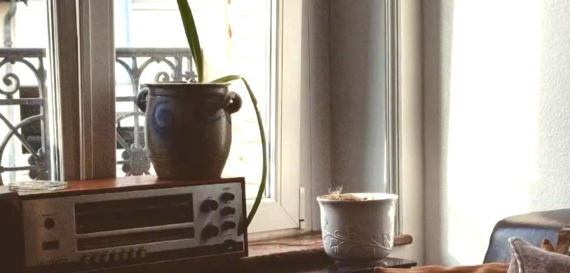

# Jolyne coucou 🐍
Culture dev et numérique, étudiante B1 @ [LaPlateforme_](https://laplateforme.io/) depuis Oct. 2024

## 🌱 Compétences

<u>Langages :</u>
- **Python** : Bases de la programmation, création de scripts simples.
- **HTML** : Création de pages web.
- **CSS** : Mise en page et designs de fonctions avec CSS.
- **Git, Obsidian md** : Gestion de données et organisation des idées.
- **CS-Paint, Figma, canva** : Réalisations visuelles, montage photo

<u>à venir :</u>
- **Javascript** : Programmation logicielle, scripts sommaires.
- **Python** : Approfondissement et résolution de problèmes, algorithmie
- **Flask** : Introduction aux applications et intégrations Python 

## 👩🏻‍🏫 Projets

### 1. Articles universitaires
- **Description** : Articles de presse de l'université de langues de Strasbourg sur l'utilisation du logiciel Obsidian lors de l'analyse de donnée linguistiques et historiques.
- **Technologies utilisées** : Obsidian.md, dataview, HTML, Wordpress
- **Liens** :
  	- [Feuillets du Nord, Sagas islandaises : Quel support pour les synthétiser ? Obsidian 1](https://nord.hypotheses.org/5097)
  	- [Feuillets du Nord, # Obsidian 2](https://nord.hypotheses.org/6575)

### 2. Projet Morpion
- **Description** : Projet en groupe de conception d'un Tic-Tact-Toe fonctionnel en langage python uniquement.
- **Technologies utilisées** : Obsidian.md, Python
- **Accès** : [Repo *Projet-VSCODE_python*](https://github.com/joseph-mangeot/Projet_VSCODE-python)

### 3. Projet Fansite
- **Description** : Projet en groupe de conception web sur une base de fanpage.
- **Technologies utilisées** : Obsidian.md, HTML, CSS
- **Accès** : [Repo *Projet-VSCODE_html*](https://github.com/joseph-mangeot/Projet_VSCODE-html)

## 📫 Contact

- **Stack overflow** : [user Jolyne](https://stackoverflow.com/users/28589708/jolyne)
- Hihi les : **AMDligents🧠**
